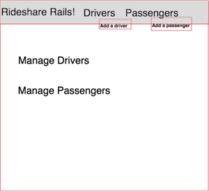
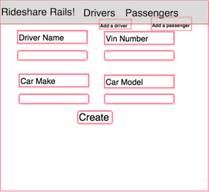
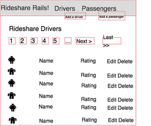
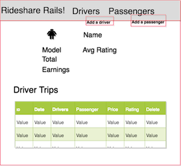
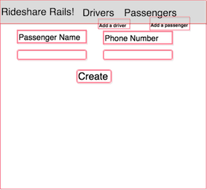
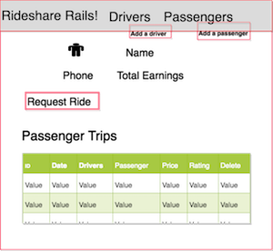
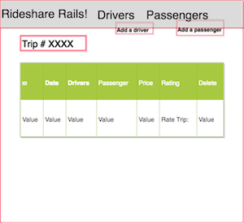

# Rideshare Rails

## At a Glance
- Pair, [stage 2](https://github.com/Ada-Developers-Academy/pedagogy/blob/master/rule-of-three.md#stage-2) project
- Due EOD **Fri, Apr 19**

## Introduction & Objective

A small community just created a Rideshare program for its local area. This project is to build a Rails app that manages that Rideshare program.

The community needs the following main pieces of functionality:
- New passengers and drivers can sign up for the service and review their information
- Passengers can request and rate trips
- Drivers can see their aggregated statistics

## Learning Goals

This project should demonstrate your ability to:

1. Create multiple related Active Record Models
1. Create models with validations and methods performing business logic
1. Craft effective RESTful routing
1. Work with a partner to create an attractive and functional Rails site
1. Practice Agile methodology
1. Work with a large amount of existing data in a Rails app

## Objective

This project is meant to be exploratory. Take time to try to dive into each piece of Rails (routes, controllers, models, views). This project is built so that you and your team can create the waves yourself based on the dependencies of the requirements given.

## Getting Started

Before you start writing _any_ code:

- High five your team
- Discuss communication style/feedback style with your team
- Review the requirements with your team
- Create a Trello board
  - Ensure all team members can manage the board
  - Write and organize tasks/stories
  - Prioritize tasks/stories
  - Discuss who is interested in which tasks and any scheduling considerations
    - What things should be done together as pairs vs individually?
- Create a diagram based on the data in the CSV files

## Setup Requirements

Once the above is complete, this project:

- Requires a shared repo with all team members as collaborators
- Requires the team to create a Rails application which
  - Conforms to Rails conventions on naming and inflection
  - Is created by using `rails new .`. You will create a new rails app _inside_ of the fork folder instead of creating a _new_ folder for your rails app
    - `rails new .` will ask if you want to overwrite the existing files `README.md` and `db/seeds.rb`. Answer `n` to both of these (keep the existing file)
  - Uses [Postgresql](https://github.com/Ada-Developers-Academy/textbook-curriculum/blob/master/08-rails/how-to-use-postgres.md) as its database. (This should already be configured correctly if you followed our Ada Install Fest for Rails)

## Baseline Requirements

However far you and your partner get, the application should have, at a minimum, the following features:

- Seeded data in your database from the original CSV files (see below)
- Multiple related Active Record models
- [RESTful routing](https://github.com/Ada-Developers-Academy/textbook-curriculum/blob/master/08-rails/mvc-and-restful-routing.md)
- A "look and feel" that will make you and your team satisfied
- Deployed application to [Heroku](https://github.com/Ada-Developers-Academy/textbook-curriculum/blob/master/00-programming-fundamentals/11-deploying-to-heroku.md)
- Your application must have controller & model tests written
  - Your model tests should include tests for validations, relationships and any custom methods
  - We have provided a set of sample tests that you can use as a starting place for the `Driver` and `Passenger` models.  We have also provided a scaffolding for the `Trip` model.  You should feel free to adapt the tests to meet your design.
  - You will also need to write tests for all controller actions
    - We have provided a controller test for a `HomepagesController`, which is a pattern we did not discuss in class. You are free to use this, discard it, or be inspired by it, as long as you sufficient controller test coverage otherwise.

### Best Practices

1. Use git relentlessly
1. Pair program on difficult problems and to share learning experiences
1. Don't leave deployment to the last second-- it will take longer than you anticipate
1. Business logic should be implemented in the model
1. You will probably need nested routes, but avoid routes that are more than 2 levels deep
1. Use semantic HTML
1. Make good use of partial views
1. Regarding validations:
    - Validations are useful for making sure your database records are sane, and you should make use of them on this project
    - It is easy to validate too much! If it's not a hard requirement for your app to function, it probably shouldn't be a validation
    - If validations fail, let the user know why

### Optional: Wireframes Requirement

We have provided some wireframes below; they are optional to use for executing layout. However, they should provide guidance for what views and information we instructors are expecting to see and interact with as we grade.  We also have an [instructor reference version](https://ada-rideshare-demo.herokuapp.com/) of the application running.  You can use this for reference or ideas.

### Seeding the Database

We have provided sample data for your site in the form of CSV files. These files are located in the directory `db/seed_data/`. We have also provided a seed script, `db/seeds.rb`, to load these files into your database.

`db/seeds.rb` assumes a few things about how your database is set up:

- There are `Driver`, `Passenger` and `Trip` models
- These models are related in a certain way
- The field names of these models match the column names in the CSV files

This is the recommended way to configure this project, but not a hard requirement. If you've got a good reason to change the setup, feel free to edit `db/seeds.rb` accordingly.

---

## Functional Requirements

This project has a lot of user stories, and it is likely you and your partner won't get to all of them. Here is our prioritized list of what's important for this project, based on this week's learning goals:

1. CRUD operations on models with relations
    - Creating new trips
1. Model validations and reporting errors to the user
1. Basic structure of a complex Rails app
1. Deployment
1. Complex business logic
    - Driver earning and average rating
1. Styling and design

Please use this list as you decide what to work on (or at the end of the week as you decide what features to cut).

### Navigation Requirements

Overall, write functionality, so that a user can easily and consistently navigate to other pages from any other page. Also, write functionality so that a user can understand form errors and correct them.

- As a user, from any page, I want to have a consistent, easily accessible navigation menu with different buttons/links. These links go to different pages that let me...
  - View a list of all passengers
  - View a list of all drivers
  - Create a new passenger
  - Create a new driver
- As a user, when I fill out any form in the site and the processing of the form submission fails, I want to be politely informed of what went wrong and how I can correct it

### Passengers Functionality Requirements

- As a user who needs to manage passengers...
  - On the passenger list page, I want to click on a passenger, so that I can see that passenger's details
  - On the passenger's details page, I want to be able to...
    - See the total amount the passenger has been charged
    - See a list of trips that passenger went on
    - Click on an individual trip from the list of trips, which will take me to a detail page for that trip
    - Click a link to edit that passenger
    - Click a link to delete that passenger
    - Click a button to add a new trip for that passenger

As a user who is adding a new passenger...
  - I want to see errors and validations that show that a passenger must be provided a name and a phone number, so that I cannot make a passenger without name or phone number

#### Details

- When a user deletes a passenger associated with a trip, it is up to you and your team on how to deal with "validations"/consequences surrounding the deleted passenger and the associated trip
- When the user clicks a button to add a new trip for that passenger, use the following default values:
  - An available driver is selected automatically by the server
  - The trip starts with no rating
- Don't worry about how a passenger's phone number is formatted

### Drivers Functionality Requirements

- As a user who needs to manage drivers...
  - On the driver list page, I want to click on a driver, so that I can see that driver's details
  - On the driver's details page, I want to be able to...
    - See the driver's total earnings, as defined by the rules in the "Details" section
    - See the driver's average rating
    - See a list of trips this driver has driven
    - Click on an individual trip from the list of trips, which will take me to a detail page for that trip
    - Click a link to edit that driver
    - Click a link to delete that driver

As a user who is adding a new driver...
  - I want to see errors and validations that show that a driver must be provided a name and VIN, so that I cannot make a driver without name or VIN

#### Details

- The driver gets 80% of the trip cost after a fee of $1.65 is subtracted
- When a user deletes a driver associated with a trip, it is up to you and your team on how to deal with "validations"/consequences surrounding the deleted driver and the associated trip
- Don't worry about how a driver's VIN is formatted

### Investigating Trips

As a user who needs to manage trips...
- When I am on a trip's detail page, I want to be able to...
  - View details of the trip
  - Assign a rating (1-5) to the trip, if it does not already have one
  - Click a link to the detail page for the trip's passenger
  - Click a link to the detail page for the trip's driver
  - Click a link to edit the trip
  - Click a link to delete the trip

## Wireframes

Homepage:

Add a Driver:

Drivers List:

Driver Show Page:

Add a Passenger:

Passenger List:

Passenger Show Page:

Trip Details:

---

## What we're looking for
You can find what instructors will be looking for in the [feedback](feedback.md) markdown document.
